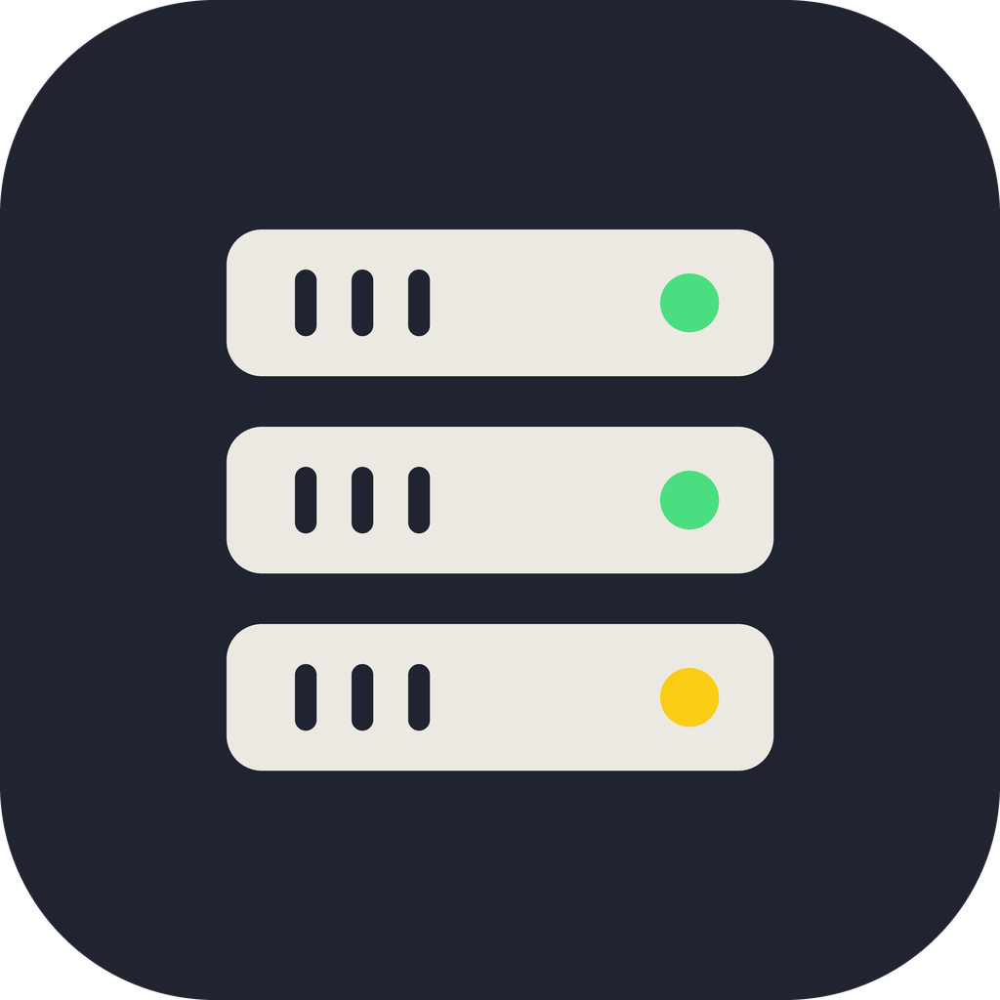
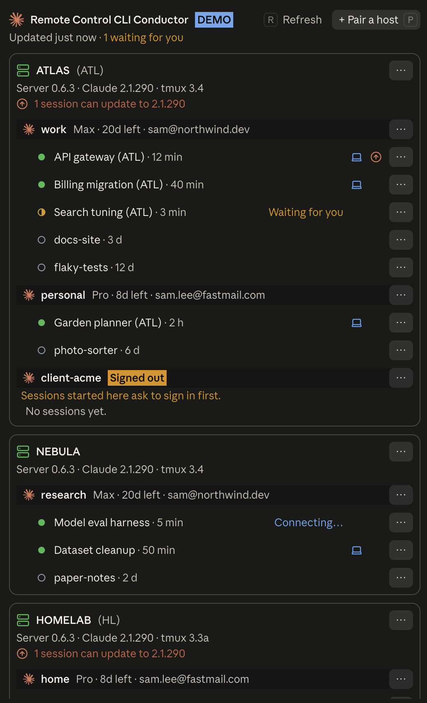
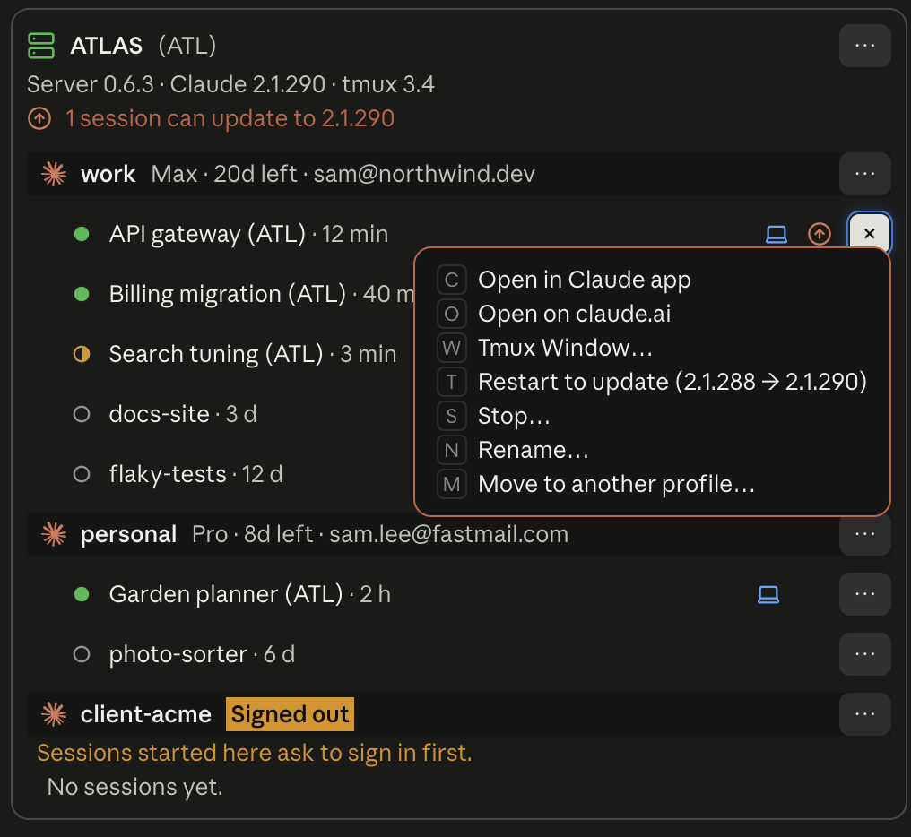
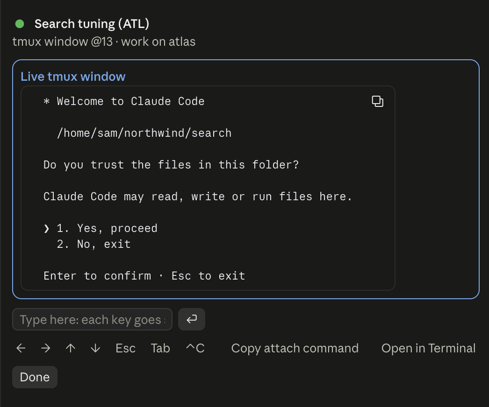
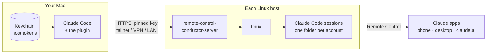

<div align="center">



# Remote Control CLI Servers

**Run Claude Code on your Linux machines, and manage it from Claude Code on your Mac.**

[](https://github.com/marcusadolfsson/remote-control-cli-servers/releases/latest)
[](https://github.com/marcusadolfsson/remote-control-cli-servers/actions/workflows/ci.yml)
[](https://code.claude.com/docs/en/plugins/mods/overview)
[](LICENSE)

[Install](#install) · [Use](#use) · [How it works](#how-it-works) · [Security](#security) · [Develop](#develop)

</div>

<table>
  <tr>
    <td rowspan="2" valign="top" width="50%">
      
    </td>
    <td valign="top">
      
    </td>
  </tr>
  <tr>
    <td valign="top">
      
    </td>
  </tr>
</table>

<p align="center"><sub>In the Claude desktop app, in demo mode: the hosts, accounts and sessions are made up.</sub></p>

## What it does

Each Linux host runs a small server that keeps Claude Code sessions running in tmux with
[Remote Control](https://code.claude.com/docs/en/remote-control) on, so they show up in the Claude
apps on your phone and desktop. It handles several Claude accounts per host, each in its own folder.

On your Mac, a Claude Code plugin (a [mod](https://code.claude.com/docs/en/plugins/mods/overview))
puts all of it in a pane beside the conversation, in the terminal or the Claude desktop app's Code
tab:

- **See everything at once.** Every host as a card, its profiles (Claude accounts) and their
  sessions, refreshing on its own, with the ones waiting for you marked.
- **Run sessions.** Start, resume, restart, stop, rename, archive and restore them.
- **Answer them.** A live view of a session's tmux window, with keys and a field to type into.
- **Move them.** Send a session to another profile, with Claude merging any memory notes both
  sides changed.
- **Switch accounts.** Sign a profile in, out, or over to another account, with the sign-in page in
  your browser.
- **Jump in.** Open a session on claude.ai or in the Claude desktop app.
- **Or just ask Claude.** The same as tools: *"restart the sessions on atlas that are waiting on an
  update"*.

## Install

> [!IMPORTANT]
> **Your Mac has to reach each host directly** on port 7443 (TCP): the same
> [Tailscale](https://tailscale.com) tailnet, a WireGuard or other VPN, or the same LAN. Nothing is
> relayed, and the server isn't meant to face the internet: it accepts only the networks it's told
> to, Tailscale's by default. Your phone doesn't need that network: the Claude apps reach the
> sessions through Remote Control.

### 1. On each Linux host

You need tmux 3.0 or newer and [Claude Code](https://code.claude.com). Then get the server (x86_64
or arm64) and run its setup:

```sh
mkdir -p ~/.local/bin && curl -fsSL https://github.com/marcusadolfsson/remote-control-cli-servers/releases/latest/download/remote-control-conductor-server-$(uname -m)-linux -o ~/.local/bin/remote-control-conductor-server && chmod +x ~/.local/bin/remote-control-conductor-server
remote-control-conductor-server setup
```

Setup checks tmux and Claude Code, finds the Claude accounts already there, asks which networks may
connect, installs a systemd user service, and prints a pairing code.

### 2. On your Mac

In Claude Code 2.1.287 or later:

```sh
claude plugin marketplace add marcusadolfsson/remote-control-cli-servers
claude plugin install remote-control-cli-servers@remote-control-cli-servers
```

### 3. Pair them

Run `/remote-control-cli-servers pair`, paste the code, and check the certificate fingerprint
matches the one setup printed. For a new code at any time, run
`remote-control-conductor-server pair` on the host.

## Use

| | |
|---|---|
| `/remote-control-cli-servers` | Opens the pane. Every host, profile and session has a **⋯** menu of its actions, each with a letter that presses it. |
| `/remote-control-cli-servers pair` | Pairs another host. |
| `/remote-control-cli-servers text` | The same as the pane, as text. |
| `/remote-control-cli-servers demo` | Swaps in three made-up hosts, for screenshots. Again to swap back. |
| Ask Claude | Its tools are `mcp__remote-control-cli-servers__*`: `list_profiles`, `list_sessions`, `new_session`, `resume_session`, `restart_outdated`, `read_window`, `send_to_window`, `move_session`, and more. |

## How it works



The plugin only talks to your hosts. The sessions talk to Anthropic as any Claude Code session
does, under the accounts signed in on each host.

## Security

- **Pinned TLS.** The server uses a self-signed certificate. Pairing records its SHA-256, and every
  request is pinned to the server's public key, so your Mac talks to that server and no other.
- **One token per Mac.** Each Mac gets its own token when it pairs. The token lives in the login
  Keychain and is handed to `curl` by the plugin's [scripts](plugin/scripts), never through the
  plugin's code or on a command line. The server keeps only its SHA-256.
- **Only its own windows.** The server types only into tmux windows it opened itself, and never
  answers a folder-trust question that would also approve tool permissions.
- **Nothing collected.** No analytics, no telemetry, no service in between. See the
  [privacy policy](PRIVACY.md), and [what the plugin runs, reads and sends](plugin/README.md#what-it-runs-reads-and-sends).

## Develop

<details>
<summary>Repository layout, checks and releases</summary>

| Folder | What |
|---|---|
| [`crates/server`](crates/server) | `remote-control-conductor-server`, the Linux server (Rust) |
| [`crates/core`](crates/core) | What the server shares with its clients: the API types, pairing codes, certificate pinning, reading Claude Code's transcripts |
| [`plugin`](plugin) | The Claude Code plugin (TypeScript, run by Claude Code) |

**Checks:**
- Rust: `cargo fmt --all --check`, `cargo clippy --workspace --all-targets -- -D warnings`,
  `cargo test --workspace`. The launch tests need tmux, so they skip on a Mac.
- Plugin: `claude plugin validate plugin` and `claude plugin test plugin`.

**Releases:** a release is a tag `v<version>`, matching the workspace's version and the plugin's.
CI builds the server for both architectures and publishes them with checksums.

</details>

---

<p align="center">
  <sub>
    MIT licensed · <a href="PRIVACY.md">Privacy</a> · <a href="TERMS.md">Terms</a> ·
    <a href="https://github.com/marcusadolfsson/remote-control-cli-servers/issues">Issues</a><br>
    Not made by, or affiliated with, Anthropic.
  </sub>
</p>
